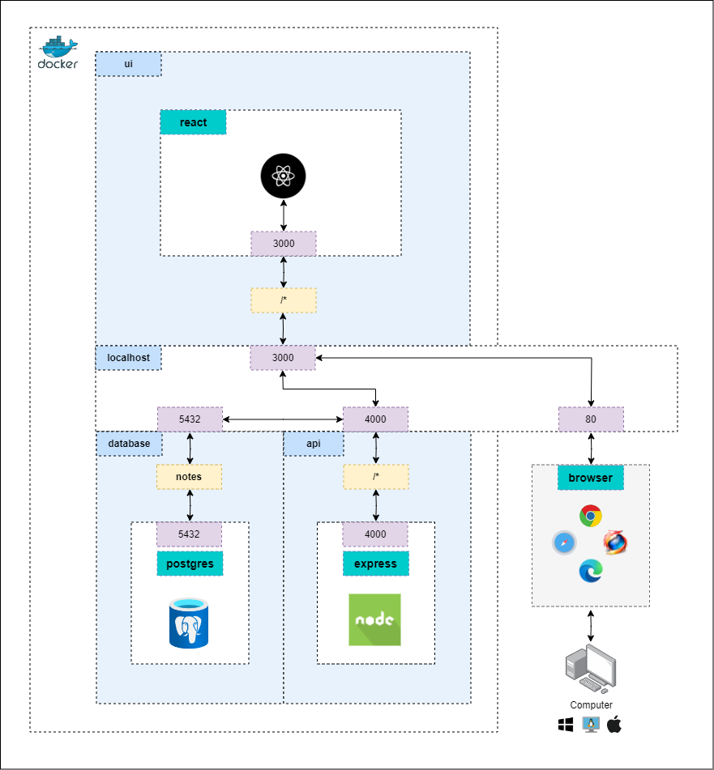
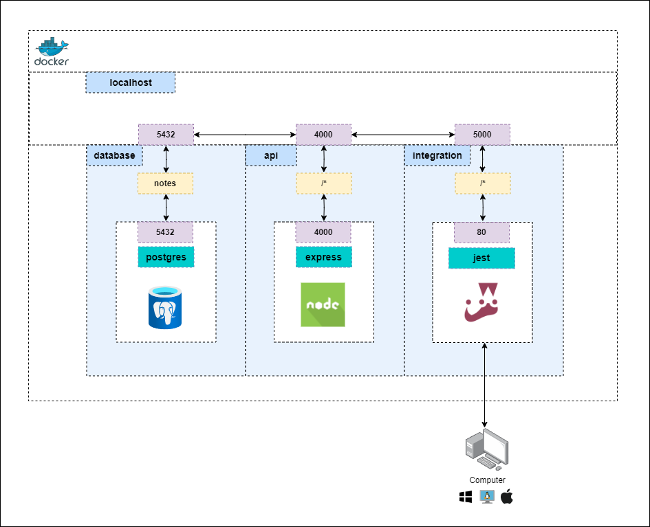
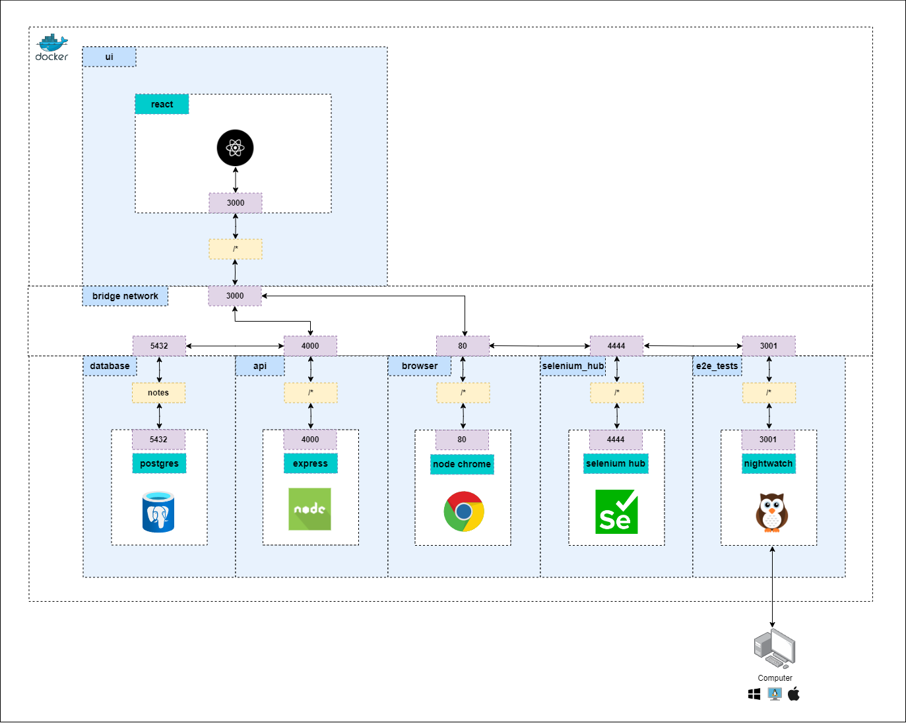
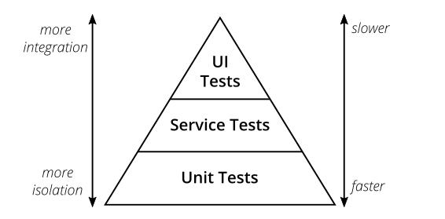
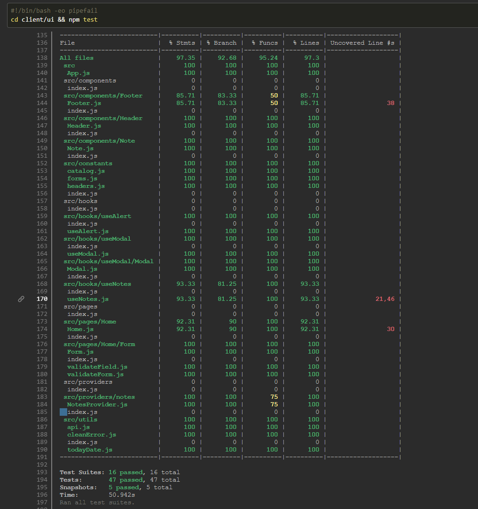
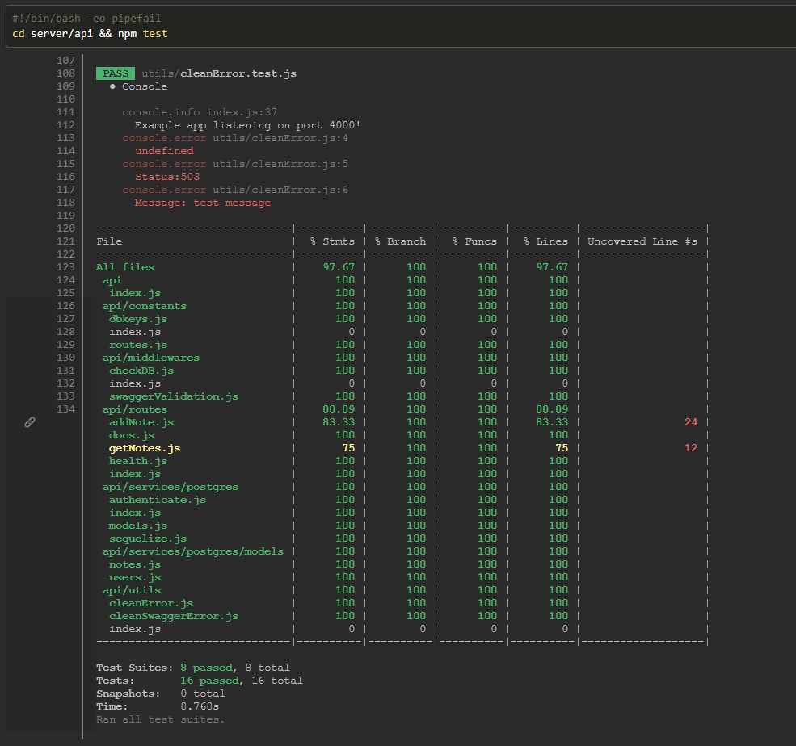
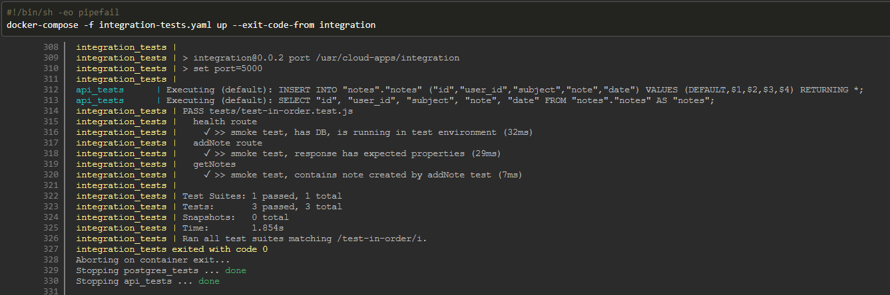
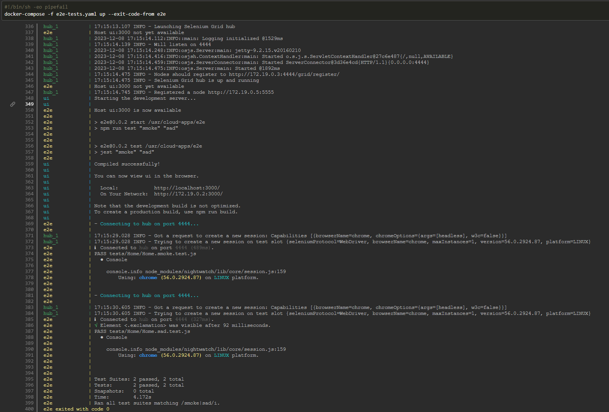
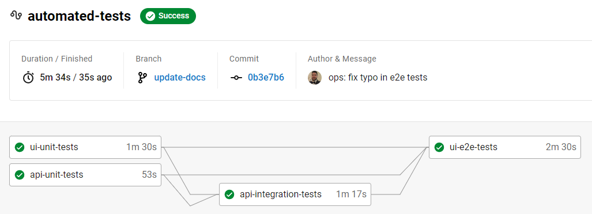

# cloud-apps-2019 &middot;    

A simple note-taking tool, built with JavaScript ES6, designed to be cloud-agnostic and serve as a starting point for more complex use cases. Each application in the system can be run independently with Docker or npm. Unit, integration and end to end (e2e) automated tests are available. Development, release, integration, and e2e test environments can be simulated with Docker Compose.

A new note can be created in a few simple steps:

#### 1. Add note

#### 2. Create and save note

#### 3. New note created

The diagram below outlines the network created by Docker Compose for development and release environments, including application connections, ports, routes and tools:

# Table of contents

* [Quickstart](https://github.com/escobard/cloud-apps-2019?tab=readme-ov-file#quickstart)
* [Technical Highlights](https://github.com/escobard/cloud-apps-2019?tab=readme-ov-file#technical-highlights)
* [Application docs](https://github.com/escobard/cloud-apps-2019?tab=readme-ov-file#application-docs)
* [How to contribute](https://github.com/escobard/cloud-apps-2019?tab=readme-ov-file#how-to-contribute)
* [Tools and frameworks](https://github.com/escobard/cloud-apps-2019?tab=readme-ov-file#tools-and-frameworks)
* [License](https://github.com/escobard/cloud-apps-2019?tab=readme-ov-file#license)

## Quickstart

### Recommended - Run environments with Docker Compose

[Docker](https://www.docker.com/) must be installed.

#### Development
`docker-compose -f dev.yaml up`

#### Release
`docker-compose -f release.yaml up`

#### Integration tests
`docker-compose -f integration-tests.yaml up --exit-code-from integration`

#### End to end tests
`docker-compose -f e2e-tests.yaml up --no-attach node-chrome --exit-code-from e2e`

### Run environments with NPM and Docker Compose

[Node.js v14.19.0](https://nodejs.org/en/) and [Docker](https://www.docker.com/) must be installed.

#### Development        
 `npm run dev`            
  
#### Release        
 `npm run start`   
 
#### Integration tests
`npm run integration-tests`

#### End to End tests
`npm run e2e-tests`

### Run applications with NPM or Docker

Find detailed instructions on how to run each application within the [Application docs](https://github.com/escobard/cloud-apps-2019?tab=readme-ov-file#application-docs).

## Technical highlights

As a portfolio piece, this project aims to showcase expertise in several areas, including:

1. [Container orchestration for scale](https://github.com/escobard/cloud-apps-2019?tab=readme-ov-file#container-orchestration-for-scale)
2. [Automated test pyramid](https://github.com/escobard/cloud-apps-2019?tab=readme-ov-file#automated-test-pyramid)
3. [Blueprint for automated tests with CircleCI](https://github.com/escobard/cloud-apps-2019?tab=readme-ov-file#blueprint-for-automated-tests-with-circleci)
4. [Full stack system built with JavaScript](https://github.com/escobard/cloud-apps-2019?tab=readme-ov-file#full-stack-system-built-with-javascript)
5. [Starting point for more complicated use cases](https://github.com/escobard/cloud-apps-2019?tab=readme-ov-file#starting-point-for-more-complicated-use-cases)

### Container orchestration for scale

Leveraging the power of Containers, the system and its applications can be deployed as-is to any cloud provider that supports Docker. It is encouraged to leverage the provided Docker Compose files, which simulate how the system & its applications run independently and together to facilitate multi-environment hosting, deployment and automation.

#### System overview

Docker Compose is used to simulate the system in different environments, creating a clone on your computer of how the system and its applications would run on a cloud. Leveraging Docker Compose, it is easier to troubleshoot multi-application systems outside of the cloud, while serving as a foundation for the cloud network that must be in place for the system to work on the cloud.

The diagram below outlines the network created by Docker Compose for development and release environments, including application connections, ports, routes and tools:

#### Integration tests

Using Docker Compose, a network can be spun up to simulate system and applications required to run integration (or service) tests. Unlike development, release and end to end test environments, the integration tests environment only contains a _partial system orchestration_, as only the API and Database are required.

The diagram below outlines the network created by Docker Compose for integration tests environment, including application connections, ports, routes and tools:

#### End to end tests

A Docker Compose network is provided, simulating the system and applications that are needed to run end to end (or UI) tests. 

The end to end tests environment has the most complex container orchestration out of all other provided environments, as it requires an application to run the tests (nightwatch), a hub to spin up browsers (selenium hub) and the browser itself (node-chrome). 

The diagram below outlines the full network required for the end to end tests environment, including application connections, ports, routes and tools:

### Automated test pyramid

Following Mike Cohn's [test pyramid](https://martinfowler.com/articles/practical-test-pyramid/testPyramid.png) approach to automated testing, the system contains a "well-rounded" automated test portfolio, which aims to cover all critical areas of the system with automated tests. 

The test pyramid paradigm encourages developers to build more unit tests (since they are small and fast), than service tests, and more service tests than UI tests (which are slow and heavy).

While the system provides over 95% unit test coverage, only critical features are covered by integration and end to end tests. The goal is to provide a starting point for developers, to extend with more complex automated tests as required.

#### UI unit tests

 

#### API unit tests

#### Integration tests

#### End to end tests

### Blueprint for automated tests with CircleCI

Leveraging CircleCI, Unit tests for each application (except for the database) are run on every new commit to Github. Once unit tests have passed, integration tests are run, validating API and Database changes. After integration tests pass, end to end (e2e) tests are run, validating that the UI, API and Database work as expected with the new changes. 

Following the [fail-fast](https://testsigma.com/blog/test-automation-achieve-fail-fast-fail-often/) automated testing approach, the system provides a starting point (or blueprint / boilerplate) as-is for more complex automated testing requirements.

### Full stack system built with JavaScript

Each application in the system uses JavaScript, with the exception of the PostgreSQL database. Leveraging (mostly) a single programming language for all applications of the system has numerous advantages, including:

- **Cross-functional engineering** - seamlessly switch between application and test code, because all code looks alike!
- **Common design patterns** - consistent design patterns and coding styles between applications facilitates readability, maintenance and extendability
- **Easier to staff and scale** - hiring and training engineers on for a single programming language is easier than (the more common) multi-language software stacks
- **Large community** - all tools, libraries and frameworks used in the system have large open source communities

### Starting point for more complicated use cases

The system and its applications can be re-used as a starting point (or blueprint / boilerplate) for more complex systems and applications. Each application provides common design patterns that can be leveraged to facilitate development of new features. All applications are containerized with Docker, ready to be deployed as-is to any cloud provider with Docker support.

## Application docs

[UI](https://github.com/escobard/cloud-apps-2019/blob/master/client/ui)  
[API](https://github.com/escobard/cloud-apps-2019/blob/master/server/api)  
[Database](https://github.com/escobard/cloud-apps-2019/tree/master/server/postgres)  
[Integration tests](https://github.com/escobard/cloud-apps-2019/tree/master/server/tests)  
[End to end tests](https://github.com/escobard/cloud-apps-2019/tree/master/client/tests)

## Tools and frameworks

[Node.js](https://nodejs.org/en)  
[Docker](https://www.docker.com/)     
[Docker Compose](https://docs.docker.com/compose/)  
[CircleCI](https://circleci.com)  
[React](https://react.dev/)  
[Express.js](https://expressjs.com/)  
[Swagger](https://swagger.io/)  
[PostgreSQL](https://www.postgresql.org/)  
[Jest](https://jestjs.io/)  
[Supertest](https://www.npmjs.com/package/supertest)    
[Nightwatch](https://nightwatchjs.org/)      
[Selenium](https://www.selenium.dev/)

## How to contribute

### Commits

Our commits follow the [Angular commit styleguide](https://gist.github.com/brianclements/841ea7bffdb01346392c). Each commit should be carefully thought out and only contain files affected within the scope of the commit message.

### Branching

A branch's name should reference a story and the type of work being committed.

### Pull Requests

Each pull request must pass a review from another contributor and all automated tests.

### Issues

Feel free to open an issue ticket, please leave a screenshot and a detailed instructions on how to replicate the issue.  

## License

This repository is protected under the [MIT License](https://choosealicense.com/licenses/mit/).
